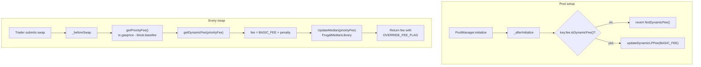
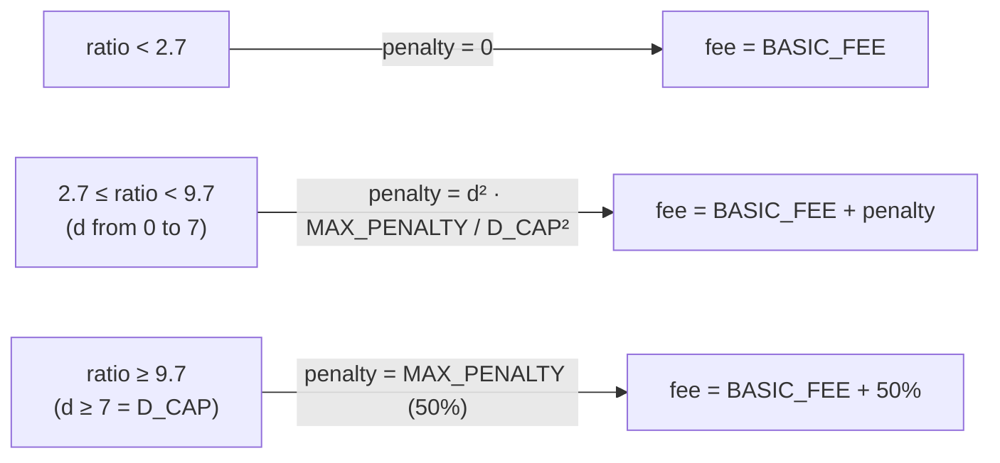
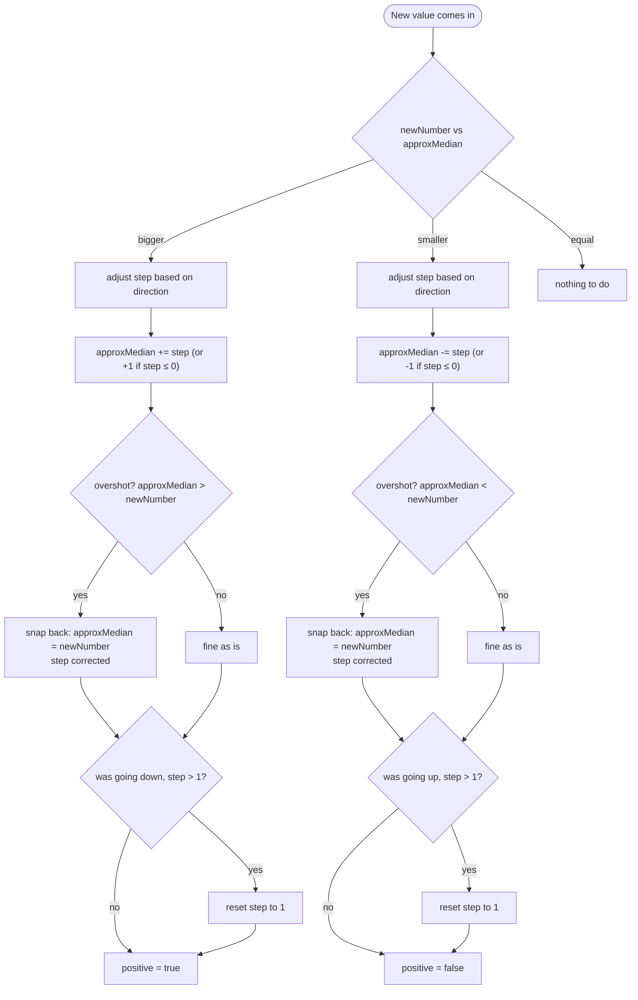

## What this does

`MedianPriorityFeeHook` is a Uniswap v4 hook built to make life a bit harder for MEV bots and gas-spammers who overpay priority fee just to jump the queue.

The idea is pretty simple: the hook keeps a running (approximate) **median** of priority fees paid across swaps, and whenever a swap's priority fee is way above that median, it gets hit with an extra fee. The bigger the gap, the bigger the penalty — up to a 50% cap.

<CardGroup cols={2}>
  <Card title="Dynamic fee" icon="chart-line">
    Fee is recalculated right before every swap, based on that swap's own priority fee
  </Card>
  <Card title="Streaming median" icon="wave-square">
    Median is estimated with a "frugal" streaming algorithm — no history stored, just a few numbers
  </Card>
  <Card title="Quadratic penalty" icon="chart-simple">
    Penalty grows non-linearly the further you stray from the median, capped at 50%
  </Card>
  <Card title="Cheap on gas" icon="bolt">
    No arrays, no sorting, no loops — just three state variables
  </Card>
</CardGroup>

---

## How it fits together

<Frame>

</Frame>

---

## What happens on a swap, step by step

<Steps>
  <Step title="Read the priority fee">
    Just `tx.gasprice - block.basefee`. If gas price isn't above base fee (or we're not in an EIP-1559 tx), priority fee is treated as zero.
  </Step>
  <Step title="Compare it to the median">
    `ratio = priorityFee * 1000 / medianPriorityFee` — scaled by 1000 so we get 3 decimal places of precision.
  </Step>
  <Step title="Apply the penalty (if any)">
    Below a 2.7x ratio, nothing happens — you just pay the base 0.1% fee. Above that, the penalty kicks in and grows quadratically until it hits the 50% ceiling.
  </Step>
  <Step title="Update the median">
    After the fee is calculated, the priority fee of this swap feeds into `FrugalMedianLibrary` to nudge the median estimate.
  </Step>
  <Step title="Override the fee">
    The final fee is returned with `LPFeeLibrary.OVERRIDE_FEE_FLAG`, which swaps out the pool's normal fee just for this transaction.
  </Step>
</Steps>

---

## The penalty formula

<Frame>

</Frame>

`d = ratio − 2.7` is how far past the threshold you are. Because the penalty scales with `d²`, small overshoots barely cost anything, but going way past the median gets punished hard and fast.

<AccordionGroup>
  <Accordion title="Constants at a glance">
    | Constant | Value | What it's for |
    |---|---|---|
    | `PRECISION` | 1000 | 3 decimal places of precision |
    | `RATIO_THRESHOLD` | 2700 (= 2.7) | below this, no penalty |
    | `D_CAP` | 7000 (= 7.0) | past this, penalty is already maxed out |
    | `BASIC_FEE` | 1000 ppm (0.1%) | the pool's base fee |
    | `MAX_PENALTY_PERCENT` | 50 | max penalty, as % |
    | `PENALTY_UNIT` | 10,000 | converts % into ppm fee units |
  </Accordion>
  <Accordion title="getDynamicFee in pseudocode">
```solidity
if (medianPriorityFee == 0) return BASIC_FEE;

ratio = priorityFee * PRECISION / medianPriorityFee;

if (ratio < RATIO_THRESHOLD) {
    penalty = 0;
} else {
    d = ratio - RATIO_THRESHOLD;
    penalty = d >= D_CAP
        ? MAX_PENALTY_PERCENT * PENALTY_UNIT
        : (d² * MAX_PENALTY_PERCENT * PENALTY_UNIT) / D_CAP²;
}

fee = BASIC_FEE + penalty;
```
  </Accordion>
</AccordionGroup>

---

## FrugalMedianLibrary: the median, on a budget

This library implements a **frugal streaming median** — an approximation that updates with every new value, no history and no sorting required. State is just three variables: `approxMedian`, `step`, and `positive`.

<Frame>

</Frame>

### The gist of it

<Steps>
  <Step title="New value is above the estimate">
    Push the estimate up by `step` (at least 1). If that overshoots the new value, snap back exactly to it and trim `step` by the overshoot amount.
  </Step>
  <Step title="New value is below the estimate">
    Same thing, mirrored — push down instead.
  </Step>
  <Step title="Direction flips">
    If the new move contradicts the last one (tracked via `positive`), `step` resets to 1. This damps oscillation so the estimate doesn't overshoot wildly when the trend reverses.
  </Step>
  <Step title="Direction confirmed">
    If it's moving the same way as before, `step` grows via `stepIncrement()` — which in this implementation always just returns `1`, so growth is linear rather than accelerating (a simplified version of the classic algorithm).
  </Step>
</Steps>

<Note>
This isn't an exact median — it's a fast approximation that drifts toward the real median over time. It can lag a bit behind sudden shifts in the distribution of values.
</Note>

---

## Hook permissions

```solidity
beforeInitialize:  false
afterInitialize:   true   // checks the pool has dynamic fees enabled
beforeAddLiquidity: false
afterAddLiquidity:  false
beforeRemoveLiquidity: false
afterRemoveLiquidity:  false
beforeSwap:  true   // computes and applies the dynamic fee
afterSwap:   false
beforeDonate: false
afterDonate:  false
```

---

## A few things worth knowing

<Warning>
**The median is shared across all pools.** `medianState` is a single contract-level variable, not a `mapping(PoolId => MedianState)`. If the same hook instance is reused by multiple pools, unusual traffic in one pool will skew the fee calculation for all the others. Worth fixing if per-pool tracking was the intent.
</Warning>

<Warning>
**No penalty right after deploy.** While `medianState.approxMedian` is still 0, `getDynamicFee` just returns `BASIC_FEE` — there's no history yet to compare against.
</Warning>

<Tip>
`stepIncrement()` always returns `1` right now, regardless of input. The classic frugal median algorithm sometimes grows the step faster on a long streak of confirmations — worth revisiting if you want the median to converge quicker.
</Tip>

---

## Quick example

| Priority fee | Median | Ratio | d (overshoot) | Penalty | Final fee |
|---|---|---|---|---|---|
| 1 gwei | 1 gwei | 1.0 | — | 0% | 0.1% |
| 2 gwei | 1 gwei | 2.0 | below threshold | 0% | 0.1% |
| 3 gwei | 1 gwei | 3.0 | 0.3 | ~0.06% | ~0.16% |
| 6 gwei | 1 gwei | 6.0 | 3.3 | ~11% | ~11.1% |
| 10 gwei | 1 gwei | 10.0 | ≥7 (capped) | 50% | 50.1% |

<Info>
Numbers are rounded for illustration — the actual fee depends on wherever the approximated median happens to sit at the time of the swap.
</Info>
